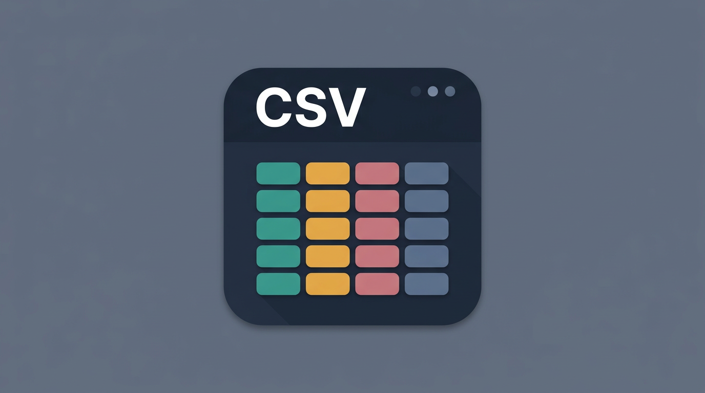

<p align="center">
  
</p>

# CSV Custom Pro

一款专为 VS Code 打造的高级 CSV 编辑器扩展，提供类似电子表格的交互体验，让您能够高效地查看、编辑和管理 CSV 数据。

## 最新成品

- 最新安装包（稳定文件名）：[`dist-产物/csv-custom-pro-latest.vsix`](dist-产物/csv-custom-pro-latest.vsix)
- 构建信息（时间 / 版本 / commit / sha256）：[`dist-产物/BUILD-INFO.md`](dist-产物/BUILD-INFO.md)
- 历史时间戳版本仍保留在 [`dist-产物/`](dist-产物/)。

---

## 功能特性

### 核心功能

- **表格化编辑**: 直接在 VS Code 中以表格形式编辑 CSV 文件，支持单元格点击编辑
- **智能列宽**: 自动计算列宽，确保数据清晰可读
- **数据类型着色**: 根据数据类型（布尔值、日期、整数、浮点数、文本）自动为列着色
- **固定表头**: 滚动时保持表头可见
- **多行单元格**: 支持单元格内换行显示
- **可点击链接**: 自动识别 URL，Ctrl/Cmd+点击打开

### 高级功能

- **过滤排序**: 支持全局搜索和列过滤，可按列排序
- **行高模式**: 三种行高模式（紧凑/单行折行/自然折行），支持手动调整
- **键盘导航**: 使用箭头键、Tab 键在单元格间移动
- **多选复制**: 支持矩形区域选择和复制
- **查找替换**: 内置查找替换功能，支持正则表达式
- **大文件支持**: 分块加载大文件，快速打开
- **多种格式**: 支持 CSV、TSV、TAB、PSV 格式

---

## 安装使用

### 安装

1. 打开 VS Code
2. 按 `Ctrl+Shift+X` (macOS: `Cmd+Shift+X`) 打开扩展市场
3. 搜索 "CSV Custom Pro"
4. 点击安装

### 使用

打开任意 `.csv`、`.tsv`、`.tab` 或 `.psv` 文件，扩展会自动以表格形式加载。

---

## 命令列表

在命令面板 (`Ctrl+Shift+P`) 中搜索：

- `CSV_CUSTOM_PRO: 切换扩展启用/禁用`
- `CSV_CUSTOM_PRO: 切换可点击链接`
- `CSV_CUSTOM_PRO: 切换行高模式（紧凑/自然折行）`
- `CSV_CUSTOM_PRO: 切换序号列`
- `CSV_CUSTOM_PRO: 更改分隔符`
- `CSV_CUSTOM_PRO: 重置分隔符`
- `CSV_CUSTOM_PRO: 更改字体`
- `CSV_CUSTOM_PRO: 隐藏前N行`
- `CSV_CUSTOM_PRO: 更改文件编码`

---

## 配置选项

### 全局设置


| 设置项                        | 类型      | 默认值       | 说明                             |
| -------------------------- | ------- | --------- | ------------------------------ |
| `csv.enabled`              | boolean | true      | 启用/禁用自定义编辑器                    |
| `csv.fontFamily`           | string  | 空         | 字体族，空则继承编辑器设置                  |
| `csv.fontSize`             | number  | 0         | 字体大小（px），0 则继承编辑器设置            |
| `csv.mouseWheelZoom`       | boolean | true      | 启用鼠标滚轮缩放                       |
| `csv.mouseWheelZoomInvert` | boolean | false     | 反转缩放方向                         |
| `csv.cellPadding`          | number  | 4         | 单元格内边距（px）                     |
| `csv.columnColorMode`      | string  | type      | 列颜色模式：type（类型着色）或 theme（主题前景色） |
| `csv.columnColorPalette`   | string  | default   | 类型颜色调色板：default、cool、warm      |
| `csv.clickableLinks`       | boolean | true      | 使 URL 可点击                      |
| `csv.showTrailingEmptyRow` | boolean | true      | 显示末尾空行                         |
| `csv.separatorMode`        | string  | extension | 分隔符选择模式                        |
| `csv.defaultSeparator`     | string  | `,`       | 默认分隔符                          |
| `csv.rowHeightMode`        | string  | firstline | 行高模式：compact、firstline、wrap    |
| `csv.maxFileSizeMB`        | number  | 10        | 文件大小限制（MB），0 表示不限制             |


### 每文件设置

- 序号列显示
- 分隔符覆盖
- 隐藏前 N 行

---

## 快捷键


| 操作   | 快捷键                    |
| ---- | ---------------------- |
| 移动选择 | 箭头键                    |
| 横向移动 | Tab / Shift+Tab        |
| 复制   | Ctrl/Cmd + C           |
| 粘贴   | Ctrl/Cmd + V           |
| 查找   | Ctrl/Cmd + F           |
| 替换   | Ctrl/Cmd + H           |
| 全选   | Ctrl/Cmd + A           |
| 缩放   | Ctrl/Cmd + +/-/0 或鼠标滚轮 |


---

## 开发

```bash
# 安装依赖
npm install

# 编译
npm run compile

# 运行测试
npm test

# 打包扩展
npm run package
```

---

## 技术栈

- TypeScript
- VS Code Extension API
- Papa Parse (CSV 解析)
- Node.js

---

## 兼容性

- VS Code 1.70.0 及更高版本
- 支持 Windows、macOS、Linux

---

## 许可证

MIT License

---

## 反馈与支持

如有问题或建议，欢迎在 GitHub 上提交 Issue。